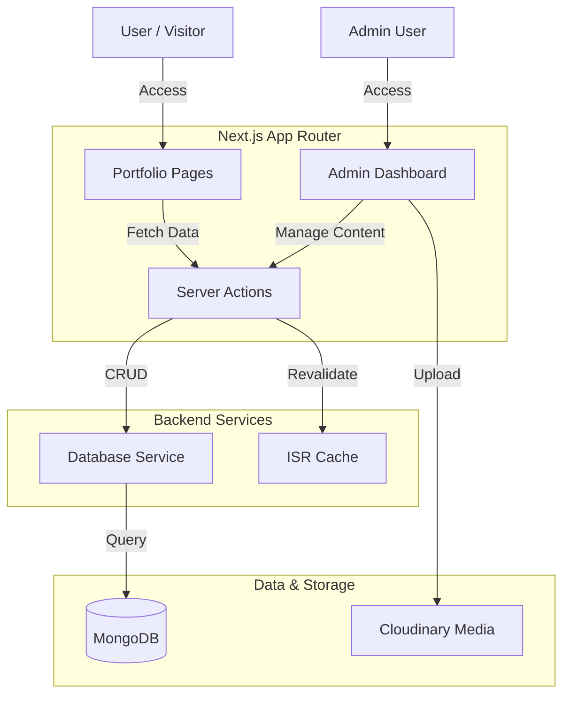

# Architecture Overview

## System Diagram

## Key Components

### 1. Data Layer (MongoDB + Mongoose)
- **Schema-First:** Defined using Mongoose models (Project, Category).
- **Global Connection:** `dbConnect` ensures a cached connection across hot reloads.
- **Indexes:** Strategic indexing on `slug`, `status`, and `featured` fields for query performance.

### 2. Service Layer
- **Abstraction:** Database logic is separated from UI and Next.js specifics.
- **Reusable:** Services (`project.service.ts`, `category.service.ts`) can be called by Server Actions or API routes.
- **Pure Functions:** Return plain JSON objects (via `.lean()`) to ensure serialization.

### 3. Action Layer (Server Actions)
- **Secure Mutations:** Actions run on the server, protected by closure or explicit checks.
- **ISR Integration:** Actions trigger `revalidatePath` to update static cache immediately after data changes.
- **Error Handling:** Standardized error catching (e.g., duplicate slug detection).

### 4. Authentication (NextAuth)
- **Middleware:** `middleware.ts` intercepts requests to `/admin` to ensure valid session.
- **Role-Based:** Checks for `admin` role before granting access to sensitive routes.

### 5. Media Pipeline
1. **Client**: `ImageUpload` requests signature (or uses unsigned preset).
2. **Cloudinary**: Processes storage and generates secure URL.
3. **Save**: Metadata (url, width, height) saved to MongoDB.
4. **Render**: `ResponsiveImage` requests optimized variants from Cloudinary.

## Directory Strategy
- **`app/`**: Route definitions only.
- **`components/`**: UI logic.
- **`lib/`**: Configuration (stateless).
- **`services/`**: Business logic (stateful/db).
- **`actions/`**: Next.js specific server entry points.

## Scalability Considerations
- **Modular Actions**: Actions are granular and reusable.
- **Optimized Queries**: Projection and pagination ready (though simplified for MVP).
- **Asset Offloading**: Large media handling is delegated to Cloudinary.
